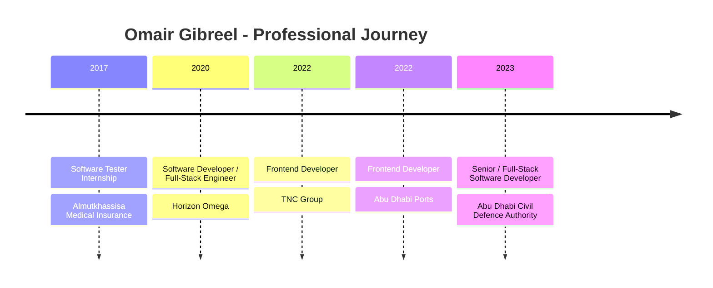

<!--
  GitHub Profile README
  Omair Gibreel / comrade1996
  Designed as an "awesome profile README" style: badges, typing animation, icons,
  code mode, stats, trophies, dynamic cards, timeline, and clean sections.
-->

<div align="center">


<br/>

<a href="https://omir.dev">
  
</a>
<a href="https://linkedin.com/in/omair-gibreel">
  
</a>
<a href="mailto:omirgibreel7@gmail.com">
  
</a>
<a href="https://github.com/comrade1996">
  
</a>
<a href="https://twitter.com/comrade96">
  
</a>

<br/>
<br/>


<br/>
<br/>


<br/>
<br/>

<em>
لو أن الناس كلما استصعبوا أمرًا تركوه، ما قام للناس دنيا ولا دين.
</em>

</div>

---

<div align="center">

# 👨‍💻 `whoami`

</div>

<table>
<tr>
<td width="58%" valign="top">

## Hi, I'm Omair 👋

I am **Omair Gibreel**, a **Senior Software Developer** based in **Abu Dhabi, United Arab Emirates**.

I have **6+ years of experience** building secure, reliable, and scalable software systems across **.NET, Blazor, Angular, API design, enterprise integrations, offline-first applications, and CI/CD delivery**.

Currently, I work at **Abu Dhabi Civil Defence Authority**, where I build secure, air-gapped systems for **prehospital operations, ambulance crews, command teams, healthcare workflows, billing systems, and internal digital transformation platforms**.

I am also currently pursuing my **Master's in AI / Artificial Intelligence**, expanding my focus in intelligent systems, applied AI, and real-world AI integration.

I build software that is:

- 🔐 Secure by design
- ⚙️ Reliable in production
- 🧩 Clean and maintainable
- 🚀 Scalable for enterprise use
- 🌍 Useful in real operational environments

</td>
<td width="42%" valign="top">

## Developer Card

```text
Name        : Omair Gibreel
Username    : comrade1996
Role        : Senior Software Developer
Location    : Abu Dhabi, UAE
Experience  : 6+ years

Backend     : .NET Core, ASP.NET Core, C#, EF Core,
              REST APIs, Microservices, IdentityServer, SQL Server

Frontend    : Angular, Blazor, TypeScript, RxJS, NgRx,
              Micro Frontends, Module Federation, HTML, CSS

Delivery    : Azure DevOps, CI/CD, Git, Cypress E2E,
              ESLint, PWA, Agile

Focus       : Air-gapped systems, offline-first apps,
              enterprise integrations, local AI features

Current Study : Master's in AI / Artificial Intelligence
```

</td>
</tr>
</table>

---

<div align="center">

# 🧭 Contents

</div>

<div align="center">

<a href="#-what-i-build">What I Build</a> •
<a href="#-tech-arsenal">Tech Arsenal</a> •
<a href="#-engineering-strengths">Strengths</a> •
<a href="#-experience">Experience</a> •
<a href="#-awards--recognition">Awards</a> •
<a href="#-come-game-with-me">Gaming</a> •
<a href="#-contact">Contact</a>

</div>

---

<div align="center">

# 🚀 What I Build

</div>

<table>
<tr>
<td width="33%" align="center">

### 🛡️ Secure Enterprise Systems

Air-gapped, reliable, internal platforms for sensitive and high-impact environments.

</td>
<td width="33%" align="center">

### 🚑 Prehospital Systems

Software for ambulance crews, command teams, healthcare workflows, and emergency operations.

</td>
<td width="33%" align="center">

### 🤖 Offline AI Features

Local LLM-powered features using tools like Ollama for secure, private, offline AI workflows.

</td>
</tr>
<tr>
<td width="33%" align="center">

### 🌐 Full-Stack Web Apps

Modern applications using .NET, Blazor, Angular, TypeScript, REST APIs, and SQL Server.

</td>
<td width="33%" align="center">

### 🔗 Enterprise Integrations

Integrations with UAE Pass, ICA, Shafafiya, authentication systems, and third-party services.

</td>
<td width="33%" align="center">

### ⚙️ DevOps & Delivery

CI/CD pipelines, Azure DevOps, Git workflows, Cypress testing, and production-ready delivery.

</td>
</tr>
</table>

---

<div align="center">

# 🧰 Tech Arsenal

</div>

<div align="center">

## Backend


<br/>
<br/>


<br/>
<br/>

## Frontend


<br/>
<br/>


<br/>
<br/>

## DevOps, Testing & Tools


<br/>
<br/>


</div>

---

<div align="center">

# 🧠 Engineering Strengths

</div>

<table>
<tr>
<td width="25%" align="center">

### Backend Engineering

ASP.NET Core, C#, EF Core, REST APIs, microservices, identity, and enterprise backend systems.

</td>
<td width="25%" align="center">

### Frontend Architecture

Angular, Blazor, TypeScript, RxJS, NgRx, reusable components, and scalable UI modules.

</td>
<td width="25%" align="center">

### Enterprise Integration

UAE Pass, ICA, Shafafiya, authentication, authorization, external APIs, and internal platforms.

</td>
<td width="25%" align="center">

### Delivery & Quality

Azure DevOps, CI/CD, Git, Cypress E2E, ESLint, Agile delivery, and production support.

</td>
</tr>
</table>

---

<div align="center">

# 💼 Experience

</div>

<details open>
<summary><b>🏢 Senior / Full-Stack Software Developer — Abu Dhabi Civil Defence Authority</b></summary>

<br/>

**Location:** Abu Dhabi, UAE  
**Period:** January 2023 - Present

- Build secure, air-gapped prehospital systems for ambulance crews and command teams.
- Develop offline-first applications that sync across isolated networks.
- Integrate local LLMs with Ollama for secure offline AI features.
- Deliver Angular and Blazor solutions with clean module boundaries.
- Integrate UAE Pass, ICA, Shafafiya, and Azure DevOps CI/CD.

</details>

<details>
<summary><b>🚢 Frontend Developer — Abu Dhabi Ports</b></summary>

<br/>

**Location:** Abu Dhabi, UAE  
**Period:** July 2022 - January 2023

- Built responsive Angular web applications.
- Split large components into reusable UI building blocks.
- Created custom directives and shared components.

</details>

<details>
<summary><b>💻 Frontend Developer — TNC Group</b></summary>

<br/>

**Location:** Dubai, UAE  
**Period:** January 2022 - August 2022

- Developed user interfaces with modern JavaScript practices.
- Built application code, unit tests, and performance checks.

</details>

<details>
<summary><b>🧩 Software Developer / Full-Stack Engineer — Horizon Omega</b></summary>

<br/>

**Location:** Khartoum  
**Period:** January 2020 - January 2022  
**Type:** Contract

- Built reusable mobile, API, and web frameworks.
- Integrated payment gateways including PayTabs, STCPay, and Telr.
- Implemented CI/CD pipelines and Cypress E2E testing.
- Authored SRS documents and REST APIs using Angular, Ionic, and Laravel.

</details>

<details>
<summary><b>🧪 Software Tester — Almutkhassisa Medical Insurance</b></summary>

<br/>

**Location:** Khartoum, Sudan  
**Period:** May 2017 - June 2017  
**Type:** Internship

- Prepared test cases and performed manual testing for mobile applications and portal systems.

</details>

---

<div align="center">

# 🏆 Awards & Recognition

</div>

<table>
<tr>
<td width="33%" align="center">

### 🥇 Best Development Project

**Abu Dhabi Civil Defence General Director's Excellence Awards, 2024**

</td>
<td width="33%" align="center">

### 🏅 Government Digital Transformation

**Dubai Quality Group recognition for Smart Ambulance Systems**

</td>
<td width="33%" align="center">

### 🥇 First Place

**CODEKING Problem Solving Competition, Al-Neelain University**

</td>
</tr>
</table>

---

<div align="center">

# 🎓 Education

</div>

<table>
<tr>
<td width="50%" align="center">

### Master's in AI / Artificial Intelligence

**Currently Pursuing**

</td>
<td width="50%" align="center">

### Bachelor of Science in Software Engineering

**Al-Neelain University**  
**2014 - 2020**

</td>
</tr>
</table>

---

<div align="center">

# 🌍 Languages


</div>

---

<div align="center">

# 🧩 Code Mode

</div>

```csharp
public sealed class OmairGibreel : SeniorSoftwareDeveloper
{
    public string Location => "Abu Dhabi, UAE";

    public string[] MainStack =>
    [
        ".NET",
        "ASP.NET Core",
        "C#",
        "Blazor",
        "Angular",
        "TypeScript",
        "SQL Server",
        "Azure DevOps"
    ];

    public string[] FocusAreas =>
    [
        "Secure Enterprise Systems",
        "Air-gapped Applications",
        "Offline-first Architecture",
        "Prehospital Systems",
        "Local AI Integration",
        "Clean Module Boundaries",
        "Reliable Delivery"
    ];

    public string Build()
    {
        return "Secure, scalable, maintainable software for real-world operations.";
    }
}
```

---

<div align="center">

# 🧭 Professional Timeline

</div>



---

<div align="center">

# 📌 Featured Focus Areas

</div>

<table>
<tr>
<td width="50%" valign="top">

## 🏥 Healthcare & Emergency Systems

- Prehospital emergency platforms
- Ambulance crew systems
- Command team dashboards
- Healthcare workflow automation
- Billing and operational systems

</td>
<td width="50%" valign="top">

## 🔐 Secure Internal Platforms

- Air-gapped applications
- Offline-first synchronization
- Identity and access control
- Secure integrations
- Enterprise-grade reliability

</td>
</tr>
<tr>
<td width="50%" valign="top">

## 🤖 AI Integration

- Local LLM features
- Ollama-based offline AI
- Secure AI workflows
- Internal automation
- AI-assisted enterprise features

</td>
<td width="50%" valign="top">

## 🌐 Modern Web Engineering

- Angular applications
- Blazor portals
- Reusable UI components
- REST API integration
- CI/CD delivery pipelines

</td>
</tr>
</table>


---

<div align="center">

# 🧪 Current Engineering Interests

</div>

<table>
<tr>
<td width="33%" align="center">

### Local AI

Secure local LLMs, Ollama, private AI workflows, internal assistant systems, and AI learning through my current master's studies.

</td>
<td width="33%" align="center">

### Enterprise Architecture

Clean module boundaries, scalable APIs, integration platforms, and maintainable systems.

</td>
<td width="33%" align="center">

### Offline-first Systems

Reliable applications that continue working across isolated or unstable network environments.

</td>
</tr>
</table>


---

<div align="center">

# 🎮🕹️ Come Game With Me

</div>

<div align="center">

I’m not only into coding — I also enjoy strategy and classic games.

**If you want, feel free to contact me for playing too, not only coding.**

</div>

<br/>

<table>
<tr>
<td width="50%" align="center" valign="top">
<a href="https://store.steampowered.com/app/287450/Rise_of_Nations_Extended_Edition/">
  
</a>

### 🏛️ Rise of Nations
Build fast, expand smarter, and pretend the economy is under control.
</td>
<td width="50%" align="center" valign="top">
<a href="https://store.steampowered.com/app/813780/Age_of_Empires_II_Definitive_Edition/">
  
</a>

### 🏰 Age of Empires
A little bit of history, a lot of villagers, and one more “just one last match”.
</td>
</tr>
<tr>
<td width="50%" align="center" valign="top">
<a href="https://store.steampowered.com/app/40970/Stronghold_Crusader_HD/">
  
</a>

### 🏹 Stronghold Crusader
Bread, archers, walls, and absolutely no mercy for weak defenses.
</td>
<td width="50%" align="center" valign="top">
<a href="https://store.steampowered.com/app/1142710/Total_War_WARHAMMER_III/">
  
</a>

### ⚔️ Total War
Big maps, bigger armies, and the classic “this battle will be easy” mistake.
</td>
</tr>
</table>

<div align="center">

```text
Gaming Side Quest
────────────────────────────────────────
Favorite vibe   : Strategy, war, planning, and chaos
Games           : Rise of Nations, Total War,
                  Age of Empires, Stronghold Crusader
Play style      : Build first, attack later, panic anyway
Multiplayer     : Yes
Open invite     : Come game with me 🎮
```

</div>

---

<div align="center">

# 🌐 Contact

<a href="https://omir.dev">
  
</a>
<a href="https://linkedin.com/in/omair-gibreel">
  
</a>
<a href="mailto:omirgibreel7@gmail.com">
  
</a>
<a href="https://github.com/comrade1996">
  
</a>
<a href="https://twitter.com/comrade96">
  
</a>

<br/>
<br/>

### 📍 Abu Dhabi, United Arab Emirates  
### 💻 Building secure, scalable, real-world software  
### 🗣️ Arabic Native | English Professional Working Proficiency  
### 🎮 Feel free to contact me for playing too — not only coding

<br/>


</div>
